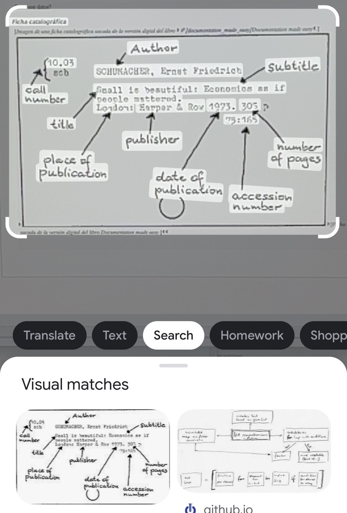
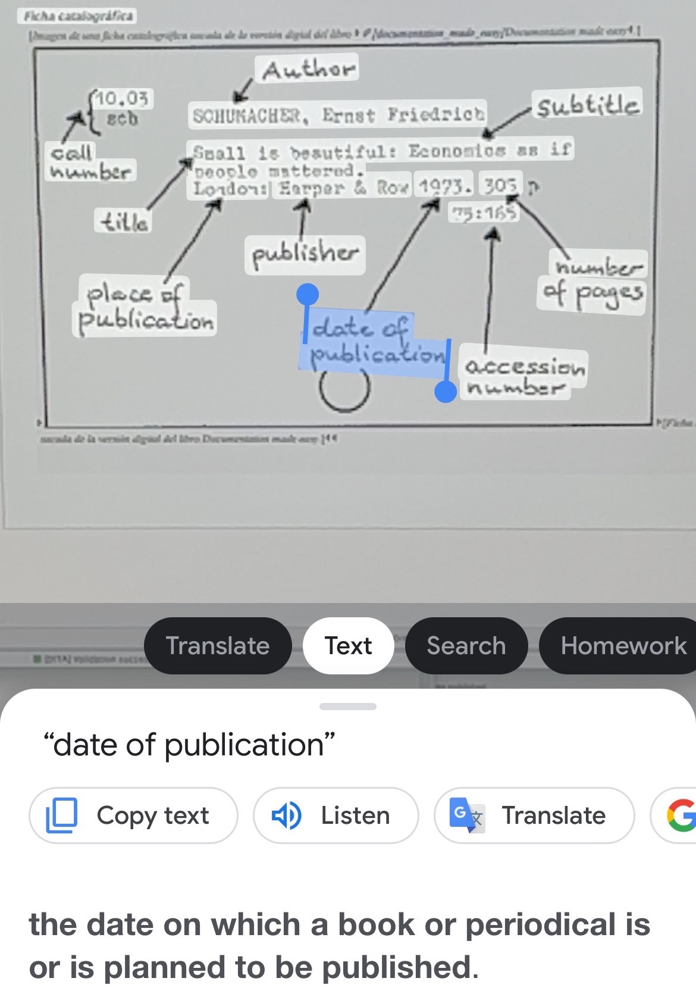
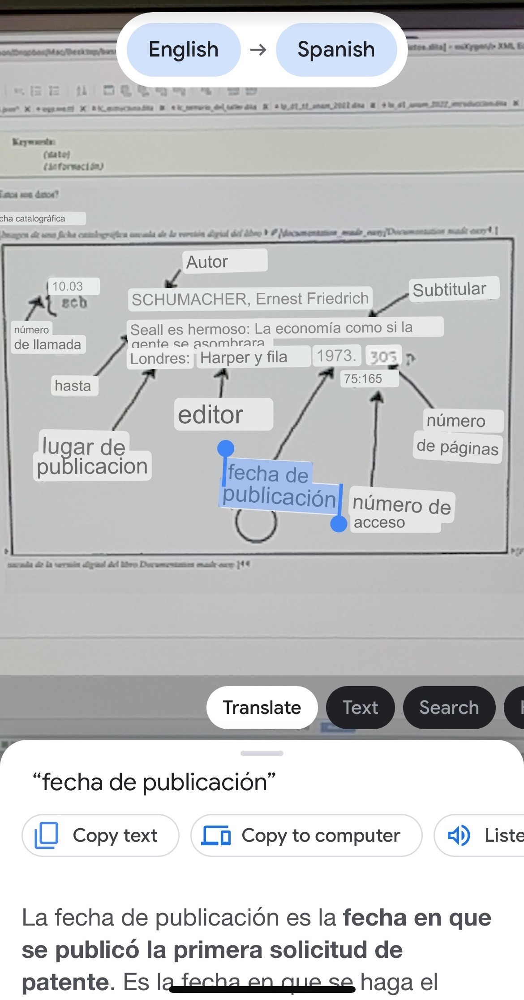
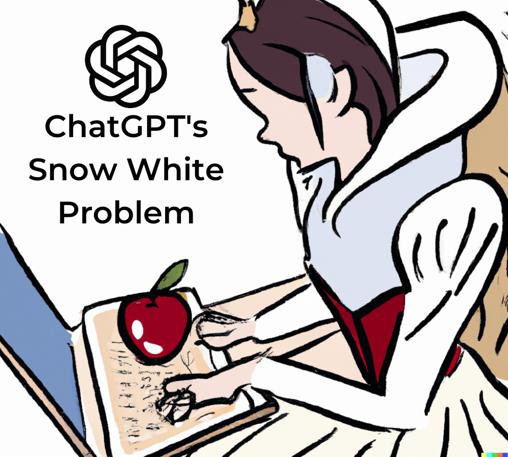

# ¿Qué son los Datos Abiertos Enlazados?

Desglosemos el término "Datos Abiertos Enlazados" palabra por palabra para entender lo que implica.

Comencemos con la palabra **datos**. ¿Cómo lo definirías? ¿Es singular o plural? ¿Cómo hablamos de ello?

## ¿Qué son datos?

Considere esta definición de "datos".

Para divertirnos, analicemos la siguiente definición de dato proveída por el *Diccionario de la Real Academia Española*. En el contexto de la informática, la palabra *[datos](https://dle.rae.es/dato)* se define como:

- *Información dispuesta de manera adecuada para su tratamiento por una computadora.*
- *Información organizada de manera que sea adecuada para su procesamiento por computadora.*

**El contenido de esta imagen, ¿se puede considerar como "datos"?**

**Resumen**

- Aunque contiene información estructurada, una ficha de catálogo impresa debe digitalizarse antes de poder transformarse en datos.
- Una vez digitalizado puede ser procesado por ordenador.
- Como profesionales de la información, creamos **metadatos** para organizar contenido de todo tipo, ya sea impreso o digital.
- Nuestro trabajo como profesionales de la información es darle sentido a los datos, crear y estructurar **conocimiento** a partir de datos sin procesar.

## El Diluvio de Datos

![Imagen derivada basada en una ilustración del vídeo 'What is Linked Data', de Manu Sporny. La parte superior de la imagen tiene la etiqueta Datos. La textura de las figuras de la imagen pretende parecerse a la plastilina. Hay cuatro cuadros, uno en cada esquina, y están ligeramente recortados en el borde exterior. El primer cuadro, en la parte superior izquierda, está etiquetado como Excel y muestra una representación abstracta de una hoja de cálculo. Moviéndose en el sentido de las agujas del reloj, el cuadro superior derecho muestra una cabeza humana rodeada de letras y líneas abstractas. El cuadro inferior derecho contiene formas (círculo y rectángulo), líneas y letras. El cuadro inferior izquierdo contiene un diseño abstracto de lo que parece un cordón enrollado, con letras y líneas. En el medio hay garabatos y una forma de flecha.](img\introduction\data_formats.png "Data Formats")

**Nota:**

Esta imagen y cuatro siguientes se derivaron de capturas de pantalla del vídeo [*What Is Linked Data?*](https://www.youtube.com/watch?v=4x_xzT5eF5Q), de Manu Sporny. El video de 12 minutos de Sporny proporciona una introducción simple al concepto y fundamento de los datos enlazados, tal como se articuló en 2012. Las imágenes incluidas aquí se generaron utilizando una implementación del modelo de generación de imágenes de Difusión Estable.

La intención detrás de la transformación de las imágenes era invitar a la reflexión sobre cómo la IA generativa ha cambiado el debate sobre los datos estructurados en la web e introducido nuevas preguntas y posibilidades.

**Resumen**

- Cuando trabajamos con datos, necesitamos comprender, describir y procesar una variedad de formatos de archivos y tipos de contenido.
- La pregunta a la que nos enfrentamos es: ¿cómo mantenemos el ritmo?
- ¿Son la solución los modelos de aprendizaje automático entrenados en conjuntos de datos cada vez más grandes?

## Minería o exploración de Datos

**Nota:**

Esta imagen y las dos siguientes representan capturas de pantalla de la aplicación "Google Lens" \(capturada en iOS en agosto de 2022\).

La intención de este ejemplo, creado antes del lanzamiento de ChatGPT, era demostrar que herramientas de inteligencia artificial como esta se pueden usar para extraer y exponer datos de nuevas maneras, pero no tienen acceso a un modelo semántico subyacente que pueda usarse para comprender el significado de los datos y lo que representan.

**Resumen**

Con el desarrollo constante de herramientas y modelos de inteligencia artificial, cada vez es más fácil extraer datos de contenidos digitales.

## Reconocimiento Inteligente de Caracteres

**Resumen**

El reconocimiento inteligente de caracteres puede facilitar la búsqueda y la comprensión.

## Traducción de Datos

**Resumen**

La traducción automática facilita la comunicación y la comprensión a través de las barreras del idioma.

## Datos Semánticos

- La minería de datos y el aprendizaje automático son tecnologías poderosas que pueden proporcionarnos información, pero no necesariamente conocimientos.

- Por sí solos, tienen una capacidad limitada para distinguir entre datos y metadatos.

- La estructura **semántica** de los datos a menudo permanece latente o invisible.

## La Web

![Imagen derivada basada en una ilustración del vídeo "What is Linked Data?", de Manu Sporny. La parte superior de la imagen tiene la etiqueta La Web. La textura de las figuras de la imagen pretende parecerse a la plastilina. Hay dos páginas, cada una medio recortada en el borde exterior, con figuras abstractas y guiones, que parecen páginas web. Desde la página de la izquierda, una flecha con la etiqueta "Enlace" se extiende hasta la página de la derecha. Desde la página de la derecha, una flecha con la etiqueta enlace apunta a una figura parecida a una ventana en la página de la izquierda. Hay una forma en plastilina parecida a una bola en el medio de la imagen en la parte inferior.](img/introduction/the_web.png "The Web of Documents")

## Comprensión \(errónea\) de la máquina

![Imagen derivada basada en una ilustración del vídeo "What is Linked Data?", de Manu Sporny. La textura de las figuras de la imagen pretende parecerse a la plastilina. A la izquierda, hay una representación de una página web medio recortada en el borde exterior, con figuras abstractas y guiones, y la palabra "Enlace" en un círculo en la parte inferior derecha de la página. En el medio de la imagen, en la parte inferior, hay una figura pequeña, abstracta, parecida a un dibujo animado, que hace un gesto hacia la página. A la derecha de la imagen, un gran robot parecido a un dibujo animado se rasca la cabeza, con un bocadillo que dice: ¿QUÉ?](img/introduction/say_whut.png "Machine (Mis)understanding")

## Data Semántica

- Tradicionalmente, el fundamento de los datos abiertos enlazados se ha explicado desde la perspectiva de una red de documentos HTML interconectados.

- Un enlace simple nos dice que dos documentos están relacionados, pero no dice cómo o en qué aspectos.

- La relación es a nivel de documento, no entre las entidades reales descritas en esos documentos.

- Sin poder determinar el significado de un enlace, la capacidad de una máquina para procesarlo es limitada.

## Deconstruyendo la Web

![Imagen derivada basada en una ilustración del vídeo "What is Linked Data?", de Manu Sporny. La textura de las figuras de la imagen pretende parecerse a la plastilina. A la izquierda, hay una representación de una página web recortada en el borde exterior, con figuras abstractas y guiones, y la palabra "Enlace" en un rectángulo en la parte inferior derecha de la página. Hay un trozo arrancado del borde central derecho de la página. En la parte inferior de la imagen, en el medio, hay tres formas redondas que pueden representar restos del trozo faltante. A la derecha, recortadas, se ven dos figuras humanas abstractas de pie bajo el brazo y la garra de una excavadora de construcción.](img/introduction/deconstructing_the_web.png "Deconstructing the Web")
 
## Comprensión de la máquina

![Imagen derivada basada en una ilustración del vídeo "What is Linked Data?", de Manu Sporny. La textura de las figuras de la imagen pretende parecerse a la plastilina. A la izquierda, hay una representación de un diagrama gráfico simple con un nodo circular en el medio que tiene una cara de dibujos animados medio sonriente. Desde el nodo central, tres bordes se extienden a la derecha, con tres nodos circulares etiquetados (moviéndose en el sentido de las agujas del reloj desde arriba), "ahora", "cumpleaños" (sic) y "¿estado de ánimo?". Otro borde se extiende a la izquierda de la página. Debajo del diagrama, hay una criatura blanca sonriente que puede parecerse a un ratón. En el centro, abajo, hay una pequeña figura de dibujos animados azulada, parecida a un animal, con los brazos levantados y un globo de diálogo vacío. A la derecha de la imagen, un robot grande parecido a un dibujo animado con una expresión en blanco (grandes ojos redondos y un pequeño punto por boca) tiene un bocadillo que dice: "¿Cumpleaños?"](img/introduction/machine_understanding.png "Machine Understanding")

- La idea de los datos enlazados es dividir datos no estructurados en unidades de información significativas.

- La web se convierte en una red de datos cuando identificamos las cosas individuales de las que estamos hablando en una página web.

- Definimos una semántica precisa para decir **qué** está relacionado con **qué** y para especificar **cómo** están relacionados.
 
## ChatGPT: Límites y Posibilidades

- Los conceptos discutidos anteriormente forman parte de la discussión tradicional sobre la web semántica.

- Sin embargo, grandes modelos de lenguaje como ChatGPT han puesto en duda esta explicación.

- ChatGPT se entrenó en gran parte utilizando el [Common Crawl](https://commoncrawl.org/), un conjunto de datos masivo de páginas web compiladas desde 2011.

    - ¿Crees que ChatGPT socava la tesis de los datos enlazados?

    - ¿Se podrá lograr la comprensión de las máquinas **sin** semántica, aprendiendo distribuciones de probabilidad complejas a partir de datos no estructurados?

")

**Resumen**

- Los datos estructurados en forma de tripletas RDF ya están integrados en el 50% de las páginas de la web.

- Como resultado, ChatGPT ya ha podido aprender e incorporar la semántica de datos estructurados.

# ¿Cuál fue la primera pelicula de animación?

**Nota:**

*Para este tema, el instructor debe tener acceso a la interfaz de usuario de ChatGPT y estar listo para demostrar el [problema](https://www.oxfordsemantic.tech/blog/chatgpts-snow-white-problem-the-danger-of-common-knowledge) descrito en la publicación del blog de "Oxford Semantic Technologies".*

A partir del 5 de junio de 2023, el problema sigue presente en GPT-3.5. En respuesta a la pregunta "¿Cuál fue el primer largometraje de animación?" el modelo proporciona la siguiente respuesta:

> El primer largometraje de animación es "Blancanieves y los siete enanitos", estrenado en 1937. Fue producido por Walt Disney Productions y se basó en el cuento de hadas alemán de los hermanos Grimm. "Blancanieves y los siete enanitos" fue un logro innovador en la animación, ya que fue el primer largometraje de animación y la primera película animada producida en color. Fue un éxito comercial, de crítica y inició el camino para el desarrollo de la industria del cine de animación.

Sin embargo, GPT-4.0 ofrece una respuesta mucho más matizada:

> El primer largometraje de animación generalmente reconocido es "Blancanieves y los siete enanitos" de Walt Disney, estrenado en 1937.

> Sin embargo, vale la pena señalar que hubo algunos intentos anteriores de crear largometrajes animados. La primera en crearse fue "El Apóstol", una película argentina de Quirino Cristiani estrenada en 1917. Lamentablemente, hoy no existen copias de esta película porque fue destruida en un incendio. Otro largometraje animado de Cristiani, "Sin dejar rastros", se estrenó en 1918 pero también se perdió. Como resultado, "Blancanieves y los siete enanitos" es el primer largometraje de animación que todavía se puede ver en la actualidad.

**Resumen**

- ChatGPT es un reflejo a gran escala del "conocimiento común".

- No está necesariamente ligado a la realidad y carece de una referencia estable al conocimiento verificado y curado.

- Los gráficos de conocimiento pueden complementar modelos de lenguaje grandes y usarse para "verificarlos".

# ChatGPT: Discussión

- Sin duda, ChatGPT ya se ha beneficiado de los datos estructurados en la web.

- Sin embargo, ¿qué es lo que realmente entiende?

- ¿Cómo podemos verificar su resultado?

- Al final, todavía necesitamos **conocimiento**, no sólo probabilidad.
