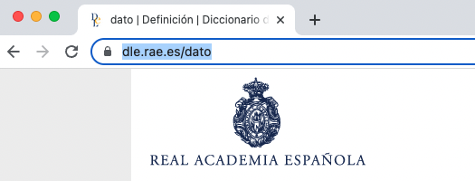

# 5 estrellas de los Datos Abiertos Enlazados

Tim Berners-Lee, el inventor de la web, ha propuesto un [sistema de clasificación](https://www.w3.org/2011/gld/wiki/5_Star_Linked_Data) para los datos de la web.

|Calificación|Criterios|
|------|--------|
|⭐|Los datos están disponibles en la Web, en cualquier formato|
|⭐⭐|Disponible como datos estructurados legibles por máquina|
|⭐⭐⭐|Disponible en formato no propietario|
|⭐⭐⭐⭐|Publicado utilizando estándares abiertos del W3C|
|⭐⭐⭐⭐⭐|Todo lo anterior y enlaces a otros Datos Abiertos Enlazados|

# Estándares de datos enlazados

- La base de los datos abiertos en;azados se basa en los estándares del "World Wide Web Consortium" \(W3C\). Es decir, estándares como:

    - El [marco de descripción de recursos](https://es.wikipedia.org/wiki/Resource_Description_Framework) (Resource Description Framework \(**RDF**\), por sus siglas en inglés)

    - El [lenguaje de Ontología Web](https://www.w3.org/2007/09/OWL-Overview-es.html) (Web Ontology Language \(**OWL**\), por sus siglas en inglés)

    - Y muchos otros… \(SPARQL, SHACL, etc.\)

# RDF


**Resumen**

- El Marco de descripción de recursos \(RDF\) es un modelo simple cuya estructura básica es una **declaración** de tres partes, o **triple**.

- Consiste en una relación entre **sujeto** y **objeto**, definida por un **predicado**.

- Un **recurso** es cualquier cosa sobre la que queremos decir algo.

- Para hacer declaraciones sobre recursos, necesitamos **identificarlos**.

- Los recursos se identifican mediante identificadores uniformes de recursos \(URI\).


# RDF es una gráfica

![Ilustración de un triple RDF en un diagrama de un grafo. Los nodos (nodes) o vértices son círculos del mismo color naranja pastel. Las aristas son flechas de color naranja. El nodo sujeto a la izquierda está etiquetado como libro1; la arista o flecha que apunta desde el nodo sujeto al nodo objeto está etiquetada como creador en el centro de la línea. A la derecha, el nodo objeto tiene la etiqueta persona1. Debajo de cada componente del grafo hay un URI correspondiente. Los URI de sujeto y objeto son URI de ejemplo arbitrarios, y el URI de predicado es el URI de Dublin Core Terms para el creador.
](img/rdf/rdf2.svg "RDF Triples as a Graph")

**Resumen**

- El objeto de una declaración puede ser un valor **literal** u otro recurso.

- Cuando hacemos afirmaciones que conectan recursos, formamos una gráfica. 

# RDF es un gráfico de \(conocimiento\)

![Una ilustración más compleja que muestra un pequeño gráfico de red de nodos conectados. Todos los nodos son círculos del mismo color naranja pastel. Las aristas o flechas de color naranja. A la izquierda, hay dos nodos, denominados libro1 y libro2. En el medio hay tres nodos que son objeto de tripletas cuyos sujetos son libro1 y libro2. Libro1 tiene dos aristas, lenguaje etiquetado y creador. La arista del idioma apunta a un nodo etiquetado lang1, que, a su vez, tiene otra arista que apunta al valor literal Español. La arista del creador apunta a un nodo etiquetado como persona1, que, a su vez, tiene otra arista etiquetada como nombre que apunta al valor Gabriel y otra arista etiquetada como apellido que apunta al valor García Márquez. Persona1 también tiene una arista, etiquetada como idioma, que apunta al nodo etiquetado como idioma1. Finalmente, libro2 tiene dos aristas, creador y sujeto. La arista creador apunta a persona1 y la arista sujeto apunta a otro nodo, que está etiquetado como concepto1.](img/rdf/rdf3.svg "RDF Triples as a Knowledge Graph")

**Resumen**

 - Cuando conectamos suficientes declaraciones sobre suficientes recursos, formamos un **gráfico de conocimiento**.

# RDF/Datos Enlazados


**Summary**

- Para los datos vinculados, identificamos recursos en la web utilizando la tecnología que ejecuta la propia web: el Protocolo de transferencia de hipertexto \(HTTP\).

- Al identificar recursos con URI HTTP \(que también pueden ser URL\), podemos publicar, interconectar y compartir datos en la web.

# RDF/Linked Data



**Previous topic:**[RDF/Linked Data](../../day_1/lesson_1/rdf_linked_data.md)

**Next topic:**[RDF/Linked Data](../../day_1/lesson_1/rdf_linked_data_3.md)

## Summary

The address [https://dle.rae.es/dato](https://dle.rae.es/dato) identifies a resource \(which we might also call an **entity**\).


# RDF/Linked Data

-   What kind of entity is identified by [https://dle.rae.es/dato](https://dle.rae.es/dato)?

-   What are its attributes?

-   Is it related to other entities?


**Note:**

Challenge participants to think about the *type* of entity represented by this URI \(a dictionary entry\). Its attributes might include things like *definition*, *etymology*, and *grammatical gender*. Its relationships to other entities might include things like:

-   A *part of* relation to the dictionary as a whole
-   Or a single dictionary entry might consist of multiple *definitions*
-   Each definition might be related to a specific domain \(e.g., computer science\)
-   An entry might also include multiple *phrases* or *expressions* in which a term is frequently used \(e.g., *base de datos*\).


# RDF

-   In an RDF graph, each **node** \(subject or object\) is a resource that we can say things about.

-   The **edges** in the graph are also resources, but we can't really say things about them in practice.


**Note:**

Work is currently underway to update the RDF specifications from version 1.1 to [1.2](https://www.w3.org/TR/rdf12-concepts/). The new versions will include support for what is known as **RDF-Star**, which will define a model and syntax for making statements about an entire triple rather than only a subject.

# RDF

-   How is RDF actually expressed?

-   We have many format options, which are called **serializations**.

-   One of the most common is called **[JSON-LD](https://www.w3.org/TR/json-ld11/)**.


## JSON-LD

Here is the JSON-LD that is embedded in the HTML page representing the dictionary entry for dato in the *Diccionario de la lengua española*:

```
[
  {"@context": "http://schema.org/"},
  {
    "@type": [
      "DefinedTermSet",
      "Book"
    ],
    "@id": "https://dle.rae.es/",
    "name": "Diccionario de la lengua española RAE - ASALE",
    "image": "https://dle.rae.es/app/doc/es/img/dle.jpg",
    "description": "Versión electrónica 23.6 del «Diccionario de la lengua española», obra lexicográfica académica pozr excelencia."
  },
  {
    "@type": "DefinedTerm",
    "@id": "https://dle.rae.es/dato",
    "name": "dato",
    "description": "1. m. Información sobre algo concreto que permite su conocimiento exacto o sirve para deducir las consecuencias derivadas de un hecho. A este problema le faltan datos numéricos.",
    "inDefinedTermSet": "https://dle.rae.es/"
  }
]
```

## JSON-LD Syntax

In the code, we can note the following:

-   The context is declared as `{"@context": "[http://schema.org/](http://schema.org/)"}`, which means that the terms are taken from the Schema.org vocabulary.

-   The resource [https://dle.rae.es/dato](https://dle.rae.es/dato) is declared to be of the type [http://schema.org/DefinedTerm](http://schema.org/DefinedTerm).

-   It is related to [https://dle.rae.es/](https://dle.rae.es/), which is a [http://schema.org/DefiniedTermSet](http://schema.org/DefiniedTermSet).
